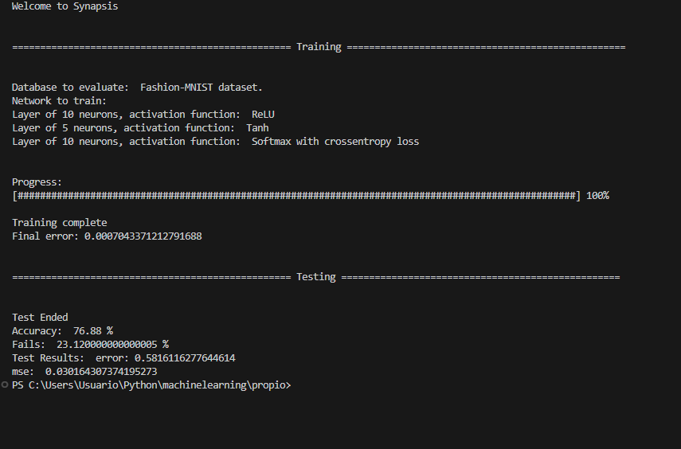

# Synaptic.

Neural Network built from scratch

## Description

Neural Network is designed as MNIST digit recognizer using numpy as its main library. The objective of this app was to create a scalable neural network with enough customization so as to be useful for other problems. In its current configuration, it is able to solve other problems similar to MNIST. The training and testing data is obtained through keras library for simplicity as it is not the objective of this app to deal with data. However, this can be easily changed by minor modifications.

The app basically consists of two parts, the network creator (net.py) and network modular parts (neurons.py and activations.py). The network creator, net.py from now on, bounds the modular parts by a configuration file, config.py. This file works as an intermediate importer, as net.py imports list containing objects lists, not only constants. This may make the app quite vulnerable to spell errors in config.py file, but eliminates unnecessary code in net.py and opens the possibility to create a new interface file for configuration on the run. neurons.py contains only one class, Dense, which is the empty neuron with its forward and backward pass functions. activations.py contains all the available activations and loss calculation functions with their gradients.


## Usage

### Dependencies

Libraries:
* numpy
* mathplotlib
* tensorflow - keras (database only)


### Executing program

To run the Neural Network: net.py

To configure the Neural Network: config.py

### Configuring the Neural Network

config.py includes all the possible options for configuration:

* To change the training and testing database, change DATA. Only two options are available in this version
```
DATA = mnist
"""Db to train and test. Options:  
                                mnist
                                fashion_mnist"""
```

* To change the Epochs to train, change EPOCHS. Only positive integers.

```
EPOCHS = 200
"""Training epochs"""
```

* To change the learning rate, change LEARNING_RATE.

```
LEARNING_RATE = 0.5
"""learning rate"""
```

* To define the layers, change the values of the list NEURONS. The order is sequential from left to right. The last layer is defined by the size of the output vector, so it is not included. To add a layer, add an element with the number of neurons. For example: [20,15,100] means 4 layers; the first of 20 neurons, the second of 15, the third of 100 and the last one defined automatically.
```
NEURONS = [10, 5]
"""Neurons of each layer. The last layer is assigned automatically"""
```

* Once the layers are defined, the activation functions must be assigned. To do this, change the list ACTIVATIONS.

WARNING: the lenght of ACTIVATIONS must be equal to NEURONS + 1 to take in acount the last layer

```
ACTIVATIONS = [ReLU(), Tanh(), Softmax_CrossEntropy()]
"""Activations functions for each layer. Options: Softmax()
                                                  Softmax_CrossEntropy()
                                                  Sigmoid()
                                                  Tanh()
                                                  ReLU()
    Softmax_CrossEntropy is used in conjunction with softmax_crossentropy_der as LOSS_DER_FUNC"""
```

Softmax() corresponds to softmax function without any loss function assigned, unlike Softmax_CrossEntropy. Due to its gradient, it is quite time-consuming.

* To choose the loss function, select one for LOSS_FUNC and then make it match with its derivative in LOSS_DER_FUNC

```
LOSS_FUNC = cross_entropy_loss
"""Loss function. Options: cross_entropy_loss
                           mean_square_error"""

LOSS_DER_FUNC = softmax_crossentropy_der
"""Loss function derivative: cross_entropy_loss_der
                             softmax_crossentropy_der
                             mean_square_error_der
   softmax_crossentropy_der is meant to be used only with Softmax_CrossEntropy as last activation function in the network"""

```

* To change the way the training progress and results are shown, change the parameters below

```
SHOW_NET = True
"""Show Neural Network to train in console."""

SHOWER = False
"""Show each epoch with its error instead of progress bar"""

GRAPH = False
"""Show error graph after training"""
```

* To test the Neural Network after training turn True TEST

```
TEST = True
"""Test after training"""

VS = True
"""Show accuracy results of test"""

```

VS shows the accuracy of the test apart from the mean square error of the test

### Running the Neural Network

Upon running net.py it may look like this, depending on the configuration:




## Author

Leonardo Mario Mazzeo
leomazzeo@gmail.com


